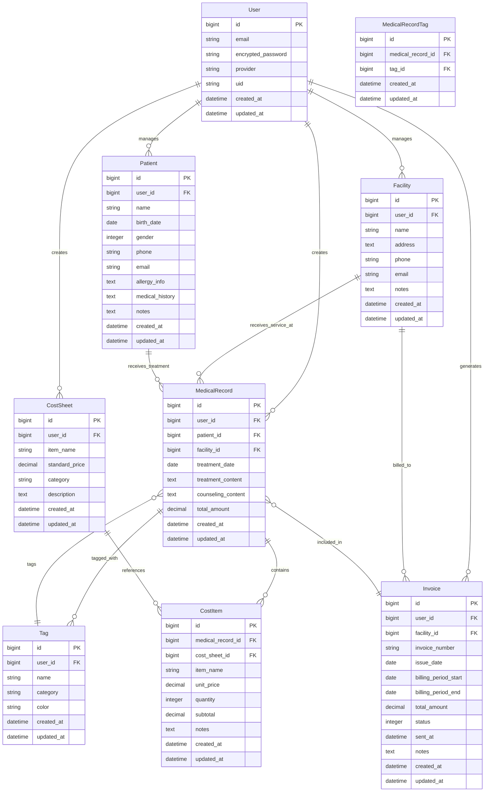

# データモデル設計書

**プロジェクト名**: フリーランス美容施術者向け電子カルテアプリ
**作成日**: 2025-10-12
**バージョン**: 1.0

---

## 1. ER図（Entity Relationship Diagram）



---

## 2. テーブル定義

### 2.1 users（ユーザー）

施術者のアカウント情報を管理するテーブル。

| カラム名 | 型 | NULL | デフォルト | 説明 |
|---------|-----|------|-----------|------|
| id | bigint | NO | auto | 主キー |
| email | string | NO | - | メールアドレス（ユニーク） |
| encrypted_password | string | NO | - | 暗号化されたパスワード |
| reset_password_token | string | YES | NULL | パスワードリセットトークン |
| reset_password_sent_at | datetime | YES | NULL | パスワードリセット送信日時 |
| remember_created_at | datetime | YES | NULL | ログイン状態維持日時 |
| provider | string | YES | NULL | OAuth認証プロバイダー（google） |
| uid | string | YES | NULL | OAuth認証用UID |
| name | string | YES | NULL | 施術者名 |
| created_at | datetime | NO | - | 作成日時 |
| updated_at | datetime | NO | - | 更新日時 |

**インデックス:**
- `email` (unique)
- `reset_password_token` (unique)
- `[provider, uid]` (unique, composite)

**備考:**
- Devise gem を使用
- OmniAuth (Google) 対応

---

### 2.2 facilities（施術場所）

クリニック・病院などの施術場所を管理するテーブル。

| カラム名 | 型 | NULL | デフォルト | 説明 |
|---------|-----|------|-----------|------|
| id | bigint | NO | auto | 主キー |
| user_id | bigint | NO | - | 外部キー（users） |
| name | string | NO | - | 施術場所名 |
| address | text | YES | NULL | 住所 |
| phone | string | YES | NULL | 電話番号 |
| email | string | YES | NULL | メールアドレス |
| notes | text | YES | NULL | 備考 |
| created_at | datetime | NO | - | 作成日時 |
| updated_at | datetime | NO | - | 更新日時 |

**インデックス:**
- `user_id`
- `name`

**バリデーション:**
- `name`: 必須、最大100文字
- `phone`: 形式チェック（任意）
- `email`: 形式チェック（任意）

---

### 2.3 patients（患者）

施術を受ける患者の情報を管理するテーブル。

| カラム名 | 型 | NULL | デフォルト | 説明 |
|---------|-----|------|-----------|------|
| id | bigint | NO | auto | 主キー |
| user_id | bigint | NO | - | 外部キー（users） |
| name | string | NO | - | 患者名 |
| birth_date | date | YES | NULL | 生年月日 |
| gender | integer | YES | NULL | 性別（0:未設定, 1:男性, 2:女性, 3:その他） |
| phone | string | YES | NULL | 電話番号 |
| email | string | YES | NULL | メールアドレス |
| allergy_info | text | YES | NULL | アレルギー情報 |
| medical_history | text | YES | NULL | 既往歴 |
| notes | text | YES | NULL | 備考 |
| created_at | datetime | NO | - | 作成日時 |
| updated_at | datetime | NO | - | 更新日時 |

**インデックス:**
- `user_id`
- `name`
- `[user_id, name]` (composite, 検索用)

**バリデーション:**
- `name`: 必須、最大100文字
- `birth_date`: 過去の日付のみ
- `phone`: 形式チェック（任意）
- `email`: 形式チェック（任意）

**enum:**
```ruby
enum gender: { unspecified: 0, male: 1, female: 2, other: 3 }
```

---

### 2.4 medical_records（カルテ）

施術記録を管理するテーブル。アプリの中心となるエンティティ。

| カラム名 | 型 | NULL | デフォルト | 説明 |
|---------|-----|------|-----------|------|
| id | bigint | NO | auto | 主キー |
| user_id | bigint | NO | - | 外部キー（users） |
| patient_id | bigint | NO | - | 外部キー（patients） |
| facility_id | bigint | NO | - | 外部キー（facilities） |
| invoice_id | bigint | YES | NULL | 外部キー（invoices） |
| treatment_date | date | NO | - | 施術日 |
| treatment_content | text | YES | NULL | 施術内容 |
| counseling_content | text | YES | NULL | カウンセリング内容 |
| total_amount | decimal(10,2) | NO | 0.00 | 合計金額 |
| created_at | datetime | NO | - | 作成日時 |
| updated_at | datetime | NO | - | 更新日時 |

**インデックス:**
- `user_id`
- `patient_id`
- `facility_id`
- `invoice_id`
- `treatment_date`
- `[user_id, treatment_date]` (composite, 検索用)
- `[facility_id, treatment_date]` (composite, 請求書生成用)

**バリデーション:**
- `patient_id`: 必須
- `facility_id`: 必須
- `treatment_date`: 必須、過去または当日のみ
- `total_amount`: 0以上

**関連:**
- `has_many :cost_items, dependent: :destroy`
- `has_many_attached :photos` (Active Storage)
- `has_many :medical_record_tags, dependent: :destroy`
- `has_many :tags, through: :medical_record_tags`

---

### 2.5 cost_sheets（コストシートテンプレート）

施術や薬剤の料金テンプレートを管理するテーブル。

| カラム名 | 型 | NULL | デフォルト | 説明 |
|---------|-----|------|-----------|------|
| id | bigint | NO | auto | 主キー |
| user_id | bigint | NO | - | 外部キー（users） |
| item_name | string | NO | - | 項目名 |
| standard_price | decimal(10,2) | NO | 0.00 | 標準価格 |
| category | string | YES | NULL | カテゴリ（施術、薬剤、消耗品など） |
| description | text | YES | NULL | 説明文 |
| created_at | datetime | NO | - | 作成日時 |
| updated_at | datetime | NO | - | 更新日時 |

**インデックス:**
- `user_id`
- `item_name`
- `category`

**バリデーション:**
- `item_name`: 必須、最大100文字
- `standard_price`: 0以上

**想定カテゴリ:**
- `treatment`: 施術
- `medicine`: 薬剤
- `supplies`: 消耗品
- `other`: その他

---

### 2.6 cost_items（コスト項目）

カルテごとの実際のコスト項目を管理するテーブル。

| カラム名 | 型 | NULL | デフォルト | 説明 |
|---------|-----|------|-----------|------|
| id | bigint | NO | auto | 主キー |
| medical_record_id | bigint | NO | - | 外部キー（medical_records） |
| cost_sheet_id | bigint | YES | NULL | 外部キー（cost_sheets、参照元） |
| item_name | string | NO | - | 項目名（コピー保存） |
| unit_price | decimal(10,2) | NO | 0.00 | 単価 |
| quantity | integer | NO | 1 | 数量 |
| subtotal | decimal(10,2) | NO | 0.00 | 小計（unit_price × quantity） |
| notes | text | YES | NULL | 備考（割引理由など） |
| created_at | datetime | NO | - | 作成日時 |
| updated_at | datetime | NO | - | 更新日時 |

**インデックス:**
- `medical_record_id`
- `cost_sheet_id`

**バリデーション:**
- `item_name`: 必須
- `unit_price`: 0以上
- `quantity`: 1以上
- `subtotal`: 0以上

**備考:**
- `cost_sheet_id` は参照元を記録（nullの場合は手動入力）
- `item_name` と `unit_price` はコピーして保存（履歴保持）
- `subtotal` は `before_save` で自動計算

---

### 2.7 invoices（請求書）

施術場所ごとの請求書を管理するテーブル。

| カラム名 | 型 | NULL | デフォルト | 説明 |
|---------|-----|------|-----------|------|
| id | bigint | NO | auto | 主キー |
| user_id | bigint | NO | - | 外部キー（users） |
| facility_id | bigint | NO | - | 外部キー（facilities） |
| invoice_number | string | NO | - | 請求書番号（自動採番） |
| issue_date | date | NO | - | 発行日 |
| billing_period_start | date | NO | - | 請求期間（開始） |
| billing_period_end | date | NO | - | 請求期間（終了） |
| total_amount | decimal(10,2) | NO | 0.00 | 合計金額 |
| status | integer | NO | 0 | ステータス |
| sent_at | datetime | YES | NULL | 送付日時 |
| notes | text | YES | NULL | 備考 |
| created_at | datetime | NO | - | 作成日時 |
| updated_at | datetime | NO | - | 更新日時 |

**インデックス:**
- `user_id`
- `facility_id`
- `invoice_number` (unique)
- `[facility_id, billing_period_start]` (composite)
- `status`

**バリデーション:**
- `invoice_number`: 必須、ユニーク
- `issue_date`: 必須
- `billing_period_start`: 必須
- `billing_period_end`: 必須、開始日以降
- `total_amount`: 0以上

**enum:**
```ruby
enum status: { draft: 0, issued: 1, sent: 2, paid: 3, cancelled: 4 }
```

**請求書番号フォーマット:**
```
INV-YYYYMM-XXXX
例: INV-202501-0001
```

**関連:**
- `has_many :medical_records`

---

### 2.8 tags（タグ）

カルテのフィルタリング・分類用のタグを管理するテーブル。

| カラム名 | 型 | NULL | デフォルト | 説明 |
|---------|-----|------|-----------|------|
| id | bigint | NO | auto | 主キー |
| user_id | bigint | NO | - | 外部キー（users） |
| name | string | NO | - | タグ名 |
| category | string | YES | NULL | カテゴリ |
| color | string | YES | '#3B82F6' | 表示色（Hex） |
| created_at | datetime | NO | - | 作成日時 |
| updated_at | datetime | NO | - | 更新日時 |

**インデックス:**
- `user_id`
- `[user_id, name]` (unique, composite)

**バリデーション:**
- `name`: 必須、最大50文字、ユーザーごとにユニーク
- `color`: Hex形式

**想定カテゴリ:**
- `location`: 施術場所関連（自動タグ）
- `treatment_type`: 施術種別
- `custom`: カスタムタグ

---

### 2.9 medical_record_tags（カルテ-タグ中間テーブル）

カルテとタグの多対多関係を管理する中間テーブル。

| カラム名 | 型 | NULL | デフォルト | 説明 |
|---------|-----|------|-----------|------|
| id | bigint | NO | auto | 主キー |
| medical_record_id | bigint | NO | - | 外部キー（medical_records） |
| tag_id | bigint | NO | - | 外部キー（tags） |
| created_at | datetime | NO | - | 作成日時 |
| updated_at | datetime | NO | - | 更新日時 |

**インデックス:**
- `medical_record_id`
- `tag_id`
- `[medical_record_id, tag_id]` (unique, composite)

**バリデーション:**
- 同じカルテに同じタグは1回のみ

---

## 3. Active Storage（画像管理）

### 3.1 active_storage_blobs

画像ファイルのメタデータを管理するテーブル（Rails標準）。

| カラム名 | 型 | 説明 |
|---------|-----|------|
| id | bigint | 主キー |
| key | string | S3のキー |
| filename | string | ファイル名 |
| content_type | string | MIMEタイプ |
| metadata | text | メタデータ（JSON） |
| byte_size | bigint | ファイルサイズ |
| checksum | string | チェックサム |
| created_at | datetime | 作成日時 |

### 3.2 active_storage_attachments

モデルとファイルの関連を管理するテーブル（Rails標準）。

| カラム名 | 型 | 説明 |
|---------|-----|------|
| id | bigint | 主キー |
| name | string | 添付名（photos） |
| record_type | string | モデル名（MedicalRecord） |
| record_id | bigint | レコードID |
| blob_id | bigint | 外部キー（active_storage_blobs） |
| created_at | datetime | 作成日時 |

**備考:**
- 1つのカルテに複数の画像を添付可能（`has_many_attached :photos`）
- 画像形式: JPEG, PNG
- 最大ファイルサイズ: 10MB/枚
- 最大枚数: 5枚/カルテ

---

## 4. リレーションシップまとめ

### 4.1 User

```ruby
class User < ApplicationRecord
  has_many :facilities, dependent: :destroy
  has_many :patients, dependent: :destroy
  has_many :medical_records, dependent: :destroy
  has_many :cost_sheets, dependent: :destroy
  has_many :invoices, dependent: :destroy
  has_many :tags, dependent: :destroy
end
```

### 4.2 Facility

```ruby
class Facility < ApplicationRecord
  belongs_to :user
  has_many :medical_records, dependent: :restrict_with_error
  has_many :invoices, dependent: :restrict_with_error
end
```

### 4.3 Patient

```ruby
class Patient < ApplicationRecord
  belongs_to :user
  has_many :medical_records, dependent: :restrict_with_error
  has_many :facilities, through: :medical_records
end
```

### 4.4 MedicalRecord

```ruby
class MedicalRecord < ApplicationRecord
  belongs_to :user
  belongs_to :patient
  belongs_to :facility
  belongs_to :invoice, optional: true

  has_many :cost_items, dependent: :destroy
  has_many :medical_record_tags, dependent: :destroy
  has_many :tags, through: :medical_record_tags

  has_many_attached :photos

  accepts_nested_attributes_for :cost_items, allow_destroy: true
end
```

### 4.5 CostSheet

```ruby
class CostSheet < ApplicationRecord
  belongs_to :user
  has_many :cost_items
end
```

### 4.6 CostItem

```ruby
class CostItem < ApplicationRecord
  belongs_to :medical_record
  belongs_to :cost_sheet, optional: true

  before_save :calculate_subtotal

  private

  def calculate_subtotal
    self.subtotal = unit_price * quantity
  end
end
```

### 4.7 Invoice

```ruby
class Invoice < ApplicationRecord
  belongs_to :user
  belongs_to :facility
  has_many :medical_records

  enum status: { draft: 0, issued: 1, sent: 2, paid: 3, cancelled: 4 }

  before_create :generate_invoice_number

  private

  def generate_invoice_number
    date_prefix = issue_date.strftime('%Y%m')
    last_invoice = Invoice.where('invoice_number LIKE ?', "INV-#{date_prefix}-%").order(:invoice_number).last

    if last_invoice
      last_number = last_invoice.invoice_number.split('-').last.to_i
      new_number = last_number + 1
    else
      new_number = 1
    end

    self.invoice_number = "INV-#{date_prefix}-#{new_number.to_s.rjust(4, '0')}"
  end
end
```

### 4.8 Tag

```ruby
class Tag < ApplicationRecord
  belongs_to :user
  has_many :medical_record_tags, dependent: :destroy
  has_many :medical_records, through: :medical_record_tags

  validates :name, uniqueness: { scope: :user_id }
end
```

---

## 5. マイグレーション実行順序

Phase 1（基本テーブル）:
1. `devise_create_users`
2. `create_facilities`
3. `create_patients`
4. `create_cost_sheets`
5. `create_medical_records`
6. `create_cost_items`
7. `create_tags`
8. `create_medical_record_tags`

Phase 2（請求書機能）:
9. `create_invoices`
10. `add_invoice_id_to_medical_records`

Active Storage:
- `rails active_storage:install` (標準のマイグレーション)

---

## 6. シードデータ（開発用）

### 6.1 初期ユーザー

```ruby
user = User.create!(
  email: 'demo@example.com',
  password: 'password',
  name: '山田 花子'
)
```

### 6.2 施術場所サンプル

```ruby
facilities = [
  { name: '〇〇美容クリニック', address: '東京都渋谷区...', phone: '03-1234-5678' },
  { name: '△△皮膚科', address: '神奈川県横浜市...', phone: '045-1234-5678' }
]

facilities.each { |f| user.facilities.create!(f) }
```

### 6.3 患者サンプル

```ruby
patients = [
  { name: '田中 花子', birth_date: '1990-05-15', gender: :female },
  { name: '佐藤 美咲', birth_date: '1985-08-20', gender: :female }
]

patients.each { |p| user.patients.create!(p) }
```

### 6.4 コストシートサンプル

```ruby
cost_sheets = [
  { item_name: '眉毛アートメイク（2D）', standard_price: 50000, category: 'treatment' },
  { item_name: '眉毛アートメイク（3D）', standard_price: 60000, category: 'treatment' },
  { item_name: '眉毛アートメイク（4D）', standard_price: 70000, category: 'treatment' },
  { item_name: 'リップアートメイク', standard_price: 70000, category: 'treatment' },
  { item_name: 'アイラインアートメイク', standard_price: 50000, category: 'treatment' },
  { item_name: '麻酔代', standard_price: 5000, category: 'medicine' },
  { item_name: 'アフターケア用品', standard_price: 3000, category: 'supplies' }
]

cost_sheets.each { |cs| user.cost_sheets.create!(cs) }
```

---

## 7. データ整合性とビジネスルール

### 7.1 削除制約

| テーブル | 制約 | 理由 |
|---------|------|------|
| Facility | restrict_with_error | カルテや請求書が存在する場合は削除不可 |
| Patient | restrict_with_error | カルテが存在する場合は削除不可 |
| CostSheet | なし（削除可能） | CostItemは参照を保持するがテンプレートは削除可 |
| MedicalRecord | cascade（CostItem） | カルテ削除時にコスト項目も削除 |

### 7.2 計算ロジック

**CostItem の subtotal 計算:**
```ruby
before_save :calculate_subtotal

def calculate_subtotal
  self.subtotal = unit_price * quantity
end
```

**MedicalRecord の total_amount 計算:**
```ruby
after_save :update_total_amount

def update_total_amount
  self.update_column(:total_amount, cost_items.sum(:subtotal))
end
```

**Invoice の total_amount 計算:**
```ruby
def calculate_total
  medical_records.sum(:total_amount)
end
```

### 7.3 請求書生成ロジック

```ruby
# 施術場所 × 月 で自動集計
def generate_invoice_for_facility(facility, year, month)
  start_date = Date.new(year, month, 1)
  end_date = start_date.end_of_month

  records = facility.medical_records
                   .where(treatment_date: start_date..end_date)
                   .where(invoice_id: nil)

  return nil if records.empty?

  invoice = Invoice.create!(
    user: current_user,
    facility: facility,
    issue_date: Date.today,
    billing_period_start: start_date,
    billing_period_end: end_date,
    total_amount: records.sum(:total_amount)
  )

  records.update_all(invoice_id: invoice.id)

  invoice
end
```

---

## 8. パフォーマンス最適化

### 8.1 インデックス戦略

**検索用複合インデックス:**
- `[user_id, treatment_date]` on medical_records
- `[facility_id, treatment_date]` on medical_records
- `[user_id, name]` on patients

**外部キーインデックス:**
- すべての `*_id` カラムにインデックス

### 8.2 N+1クエリ対策

```ruby
# カルテ一覧
MedicalRecord.includes(:patient, :facility, :cost_items).all

# 請求書詳細
Invoice.includes(medical_records: [:patient, :cost_items]).find(id)
```

### 8.3 データベース設定

```yaml
# config/database.yml
production:
  pool: <%= ENV.fetch("RAILS_MAX_THREADS") { 5 } %>
  timeout: 5000
  # PostgreSQL最適化
  prepared_statements: true
  advisory_locks: true
```

---

## 9. セキュリティ考慮事項

### 9.1 アクセス制御

すべてのモデルで `user_id` による所有者チェックを実施。

```ruby
class MedicalRecordsController < ApplicationController
  before_action :authenticate_user!

  def index
    @medical_records = current_user.medical_records
  end
end
```

### 9.2 マスアサインメント対策

Strong Parameters を使用。

```ruby
def medical_record_params
  params.require(:medical_record).permit(
    :patient_id, :facility_id, :treatment_date,
    :treatment_content, :counseling_content,
    photos: [],
    cost_items_attributes: [:id, :item_name, :unit_price, :quantity, :notes, :_destroy]
  )
end
```

### 9.3 画像アップロード検証

```ruby
class MedicalRecord < ApplicationRecord
  validate :photos_validation

  private

  def photos_validation
    return unless photos.attached?

    if photos.count > 5
      errors.add(:photos, '画像は最大5枚までアップロード可能です')
    end

    photos.each do |photo|
      unless photo.content_type.in?(%w[image/jpeg image/png])
        errors.add(:photos, 'JPEG または PNG 形式のみアップロード可能です')
      end

      if photo.byte_size > 10.megabytes
        errors.add(:photos, '画像サイズは10MB以下にしてください')
      end
    end
  end
end
```

---

## 10. バックアップ戦略

### 10.1 PostgreSQL自動バックアップ

Render提供の自動バックアップ機能を利用。

- 日次バックアップ: 7日間保持
- 週次バックアップ: 4週間保持

### 10.2 画像データのバックアップ

AWS S3のバージョニング機能を有効化。

```ruby
# config/storage.yml
amazon:
  service: S3
  access_key_id: <%= ENV['AWS_ACCESS_KEY_ID'] %>
  secret_access_key: <%= ENV['AWS_SECRET_ACCESS_KEY'] %>
  region: ap-northeast-1
  bucket: <%= ENV['S3_BUCKET_NAME'] %>
  # バージョニング有効化（S3コンソールで設定）
```

---

## 付録

### A. マイグレーションファイル例

```ruby
# db/migrate/YYYYMMDDHHMMSS_create_medical_records.rb
class CreateMedicalRecords < ActiveRecord::Migration[7.1]
  def change
    create_table :medical_records do |t|
      t.references :user, null: false, foreign_key: true
      t.references :patient, null: false, foreign_key: true
      t.references :facility, null: false, foreign_key: true
      t.references :invoice, null: true, foreign_key: true
      t.date :treatment_date, null: false
      t.text :treatment_content
      t.text :counseling_content
      t.decimal :total_amount, precision: 10, scale: 2, default: 0.00, null: false

      t.timestamps
    end

    add_index :medical_records, [:user_id, :treatment_date]
    add_index :medical_records, [:facility_id, :treatment_date]
  end
end
```

---

**Document Version**: 1.0
**Last Updated**: 2025-10-12
**Next Review**: 実装フェーズ開始時
