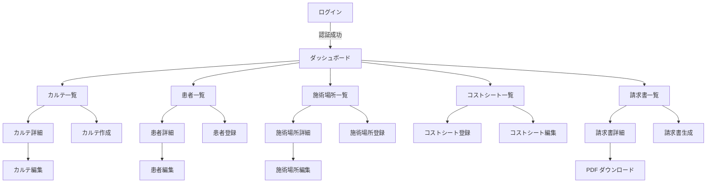

# 画面設計書

**プロジェクト名**: フリーランスアートメイク施術者向け電子カルテアプリ
**作成日**: 2025-10-12
**バージョン**: 1.0
**言語**: 日本語

---

## 1. はじめに

### 1.1 本ドキュメントの目的

本書は、電子カルテアプリの全画面の詳細設計を記述し、UI実装の指針とするものです。

**対象読者:**
- 開発者（自分自身）
- UIレビュアー
- ユーザー（フリーランス施術者）

**記載内容:**
- 全画面のワイヤーフレーム
- 画面遷移図
- フォーム項目詳細
- バリデーションメッセージ
- エラーハンドリング
- レスポンシブ対応

### 1.2 デザイン方針

- **シンプル**: 美容施術の現場で直感的に使える
- **モバイルファースト**: スマートフォンでも快適に操作
- **アクセシビリティ**: 色覚多様性に配慮、適切なコントラスト
- **パフォーマンス**: 軽量、高速レスポンス
- **一貫性**: Tailwind CSSベースの統一デザイン

---

## 2. 画面一覧

### 2.1 Phase 0（基盤）

| 画面ID | 画面名 | URL | 説明 |
|-------|--------|-----|------|
| AUTH-01 | ログイン | /users/sign_in | メール/パスワードログイン |
| AUTH-02 | 新規登録 | /users/sign_up | 新規ユーザー登録 |
| AUTH-03 | パスワードリセット | /users/password/new | パスワード再設定 |
| DASH-01 | ダッシュボード | / | トップページ、売上サマリー |

### 2.2 Phase 1（MVP）

| 画面ID | 画面名 | URL | 説明 |
|-------|--------|-----|------|
| FAC-01 | 施術場所一覧 | /facilities | 施術場所の一覧表示 |
| FAC-02 | 施術場所詳細 | /facilities/:id | 施術場所の詳細・売上 |
| FAC-03 | 施術場所登録 | /facilities/new | 新規施術場所登録 |
| FAC-04 | 施術場所編集 | /facilities/:id/edit | 施術場所情報編集 |
| PAT-01 | 患者一覧 | /patients | 患者の一覧表示・検索 |
| PAT-02 | 患者詳細 | /patients/:id | 患者詳細・施術履歴 |
| PAT-03 | 患者登録 | /patients/new | 新規患者登録 |
| PAT-04 | 患者編集 | /patients/:id/edit | 患者情報編集 |
| COST-01 | コストシート一覧 | /cost_sheets | コストシートの一覧 |
| COST-02 | コストシート登録 | /cost_sheets/new | 新規コストシート登録 |
| COST-03 | コストシート編集 | /cost_sheets/:id/edit | コストシート編集 |
| MR-01 | カルテ一覧 | /medical_records | カルテの一覧・検索 |
| MR-02 | カルテ詳細 | /medical_records/:id | カルテ詳細表示 |
| MR-03 | カルテ作成 | /medical_records/new | 新規カルテ作成 |
| MR-04 | カルテ編集 | /medical_records/:id/edit | カルテ編集 |

### 2.3 Phase 2（拡張機能）

| 画面ID | 画面名 | URL | 説明 |
|-------|--------|-----|------|
| INV-01 | 請求書一覧 | /invoices | 請求書の一覧 |
| INV-02 | 請求書詳細 | /invoices/:id | 請求書詳細表示 |
| INV-03 | 請求書生成 | /invoices/new | 請求書生成フォーム |
| STAT-01 | 売上管理 | /statistics/revenue | 月次・年次売上分析 |

---

## 3. 全体レイアウト設計

### 3.1 共通ヘッダー（認証後）

```
┌─────────────────────────────────────────────┐
│ [ロゴ] 電子カルテ    [ダッシュボード] [カルテ] [患者] [施術場所] [コストシート] [請求書]     [👤 ユーザー名 ▼] │
└─────────────────────────────────────────────┘
```

**実装仕様:**
- 高さ: 64px
- 背景色: `bg-blue-600` (Tailwind)
- テキスト色: `text-white`
- レスポンシブ: モバイルではハンバーガーメニュー（≡）

**ドロップダウンメニュー:**
- マイアカウント
- ログアウト

### 3.2 サイドバー（オプション - Phase 3以降）

Phase 1ではトップナビゲーションのみ。将来的にサイドバー検討。

### 3.3 フッター

```
┌─────────────────────────────────────────────┐
│  © 2025 電子カルテアプリ | プライバシーポリシー | 利用規約  │
└─────────────────────────────────────────────┘
```

**実装仕様:**
- 高さ: 48px
- 背景色: `bg-gray-100`
- テキスト色: `text-gray-600`

---

## 4. 認証画面設計

### 4.1 AUTH-01: ログイン画面

#### 4.1.1 ワイヤーフレーム

```
┌─────────────────────────────────┐
│                                 │
│        [ロゴ]                    │
│     電子カルテアプリ              │
│                                 │
│  ┌───────────────────────────┐  │
│  │ メールアドレス              │  │
│  │ [__________________]      │  │
│  │                           │  │
│  │ パスワード                 │  │
│  │ [__________________]      │  │
│  │                           │  │
│  │ □ ログイン状態を保持       │  │
│  │                           │  │
│  │  [  ログイン  ]           │  │
│  │                           │  │
│  │  または                    │  │
│  │                           │  │
│  │  [ 🔗 Googleでログイン ]  │  │
│  │                           │  │
│  │  パスワードを忘れた方       │  │
│  │  新規登録はこちら          │  │
│  └───────────────────────────┘  │
│                                 │
└─────────────────────────────────┘
```

#### 4.1.2 フォーム項目

| 項目名 | 入力タイプ | 必須 | バリデーション |
|-------|-----------|-----|---------------|
| メールアドレス | email | ✅ | メール形式、最大255文字 |
| パスワード | password | ✅ | 最低6文字 |
| ログイン状態を保持 | checkbox | - | - |

#### 4.1.3 バリデーションメッセージ

- **メールアドレスが未入力**: 「メールアドレスを入力してください」
- **メール形式エラー**: 「正しいメールアドレスを入力してください」
- **パスワード未入力**: 「パスワードを入力してください」
- **認証失敗**: 「メールアドレスまたはパスワードが正しくありません」

#### 4.1.4 実装仕様

**Viewファイル**: `app/views/devise/sessions/new.html.erb`

**主要クラス:**
- カード: `bg-white shadow-lg rounded-lg p-8 max-w-md mx-auto`
- 入力欄: `border border-gray-300 rounded-md px-4 py-2 w-full`
- ボタン: `bg-blue-600 text-white px-6 py-2 rounded-md hover:bg-blue-700`
- Google OAuth ボタン: `bg-white border border-gray-300 text-gray-700 px-6 py-2 rounded-md hover:bg-gray-50`

---

### 4.2 AUTH-02: 新規登録画面

#### 4.2.1 ワイヤーフレーム

```
┌─────────────────────────────────┐
│                                 │
│       新規ユーザー登録           │
│                                 │
│  ┌───────────────────────────┐  │
│  │ 名前（任意）               │  │
│  │ [__________________]      │  │
│  │                           │  │
│  │ メールアドレス             │  │
│  │ [__________________]      │  │
│  │                           │  │
│  │ パスワード（6文字以上）     │  │
│  │ [__________________]      │  │
│  │                           │  │
│  │ パスワード（確認）         │  │
│  │ [__________________]      │  │
│  │                           │  │
│  │  [  登録する  ]           │  │
│  │                           │  │
│  │  すでにアカウントをお持ちの方 │
│  │  ログインはこちら          │  │
│  └───────────────────────────┘  │
│                                 │
└─────────────────────────────────┘
```

#### 4.2.2 フォーム項目

| 項目名 | 入力タイプ | 必須 | バリデーション |
|-------|-----------|-----|---------------|
| 名前 | text | - | 最大100文字 |
| メールアドレス | email | ✅ | メール形式、ユニーク |
| パスワード | password | ✅ | 最低6文字 |
| パスワード（確認） | password | ✅ | パスワードと一致 |

#### 4.2.3 バリデーションメッセージ

- **メールアドレス重複**: 「このメールアドレスは既に登録されています」
- **パスワード不一致**: 「パスワードとパスワード（確認）が一致しません」
- **パスワード短い**: 「パスワードは6文字以上で入力してください」

---

## 5. ダッシュボード設計

### 5.1 DASH-01: ダッシュボード

#### 5.1.1 ワイヤーフレーム

```
┌──────────────────────────────────────────────────────┐
│  [ヘッダー]                                           │
├──────────────────────────────────────────────────────┤
│                                                      │
│  ダッシュボード                                       │
│                                                      │
│  ┌─────────────┐ ┌─────────────┐ ┌─────────────┐   │
│  │  今月の売上  │ │  先月の売上  │ │  患者数     │   │
│  │  ¥150,000   │ │  ¥120,000   │ │     24     │   │
│  └─────────────┘ └─────────────┘ └─────────────┘   │
│                                                      │
│  ┌─────────────┐                                    │
│  │ 施術場所数   │                                    │
│  │      3      │                                    │
│  └─────────────┘                                    │
│                                                      │
│  最近のカルテ                                         │
│  ┌──────────────────────────────────────────────┐   │
│  │ 2025-10-10 | 田中花子 | ○○クリニック | ¥50,000│   │
│  │ 2025-10-09 | 佐藤美咲 | △△病院     | ¥60,000│   │
│  │ 2025-10-08 | 鈴木愛   | ○○クリニック | ¥45,000│   │
│  │ 2025-10-07 | 高橋彩   | □□医院     | ¥55,000│   │
│  │ 2025-10-06 | 伊藤梨花 | ○○クリニック | ¥50,000│   │
│  └──────────────────────────────────────────────┘   │
│                                       [すべて見る]    │
│                                                      │
└──────────────────────────────────────────────────────┘
```

#### 5.1.2 コンポーネント設計

**1. サマリーカード（4枚）**

```html
<div class="grid grid-cols-1 md:grid-cols-4 gap-4 mb-8">
  <!-- 今月の売上 -->
  <div class="bg-white rounded-lg shadow p-6">
    <p class="text-gray-500 text-sm">今月の売上</p>
    <p class="text-3xl font-bold text-blue-600">¥150,000</p>
    <p class="text-green-500 text-sm">↑ 25% 先月比</p>
  </div>

  <!-- 先月の売上 -->
  <div class="bg-white rounded-lg shadow p-6">
    <p class="text-gray-500 text-sm">先月の売上</p>
    <p class="text-3xl font-bold text-gray-700">¥120,000</p>
  </div>

  <!-- 患者数 -->
  <div class="bg-white rounded-lg shadow p-6">
    <p class="text-gray-500 text-sm">患者数</p>
    <p class="text-3xl font-bold text-gray-700">24</p>
  </div>

  <!-- 施術場所数 -->
  <div class="bg-white rounded-lg shadow p-6">
    <p class="text-gray-500 text-sm">施術場所数</p>
    <p class="text-3xl font-bold text-gray-700">3</p>
  </div>
</div>
```

**2. 最近のカルテテーブル**

```html
<div class="bg-white rounded-lg shadow overflow-hidden">
  <table class="min-w-full divide-y divide-gray-200">
    <thead class="bg-gray-50">
      <tr>
        <th class="px-6 py-3 text-left text-xs font-medium text-gray-500 uppercase">施術日</th>
        <th class="px-6 py-3 text-left text-xs font-medium text-gray-500 uppercase">患者名</th>
        <th class="px-6 py-3 text-left text-xs font-medium text-gray-500 uppercase">施術場所</th>
        <th class="px-6 py-3 text-left text-xs font-medium text-gray-500 uppercase">金額</th>
      </tr>
    </thead>
    <tbody class="bg-white divide-y divide-gray-200">
      <!-- 各行 -->
    </tbody>
  </table>
</div>
```

---

## 6. 施術場所画面設計

### 6.1 FAC-01: 施術場所一覧

#### 6.1.1 ワイヤーフレーム

```
┌──────────────────────────────────────────────────────┐
│  [ヘッダー]                                           │
├──────────────────────────────────────────────────────┤
│                                                      │
│  施術場所一覧                      [+ 新規登録]       │
│                                                      │
│  ┌──────────────────────────────────────────────┐   │
│  │ ○○クリニック                                 │   │
│  │ 〒123-4567 東京都渋谷区...                    │   │
│  │ 📞 03-1234-5678                               │   │
│  │ 施術記録: 15件 | 売上: ¥750,000              │   │
│  │                          [詳細] [編集] [削除] │   │
│  ├──────────────────────────────────────────────┤   │
│  │ △△病院                                       │   │
│  │ 〒456-7890 東京都新宿区...                    │   │
│  │ 📞 03-5678-1234                               │   │
│  │ 施術記録: 8件 | 売上: ¥400,000               │   │
│  │                          [詳細] [編集] [削除] │   │
│  ├──────────────────────────────────────────────┤   │
│  │ □□医院                                       │   │
│  │ 〒789-0123 東京都目黒区...                    │   │
│  │ 施術記録: 3件 | 売上: ¥150,000               │   │
│  │                          [詳細] [編集] [削除] │   │
│  └──────────────────────────────────────────────┘   │
│                                                      │
│                          [1] 2 3 次へ >             │
│                                                      │
└──────────────────────────────────────────────────────┘
```

#### 6.1.2 機能仕様

**検索機能（Phase 3）:**
- 施術場所名での部分一致検索

**ソート機能:**
- デフォルト: 施術場所名の五十音順
- 売上順（降順）

**削除制限:**
- 施術記録が存在する場合は削除不可
- 削除確認ダイアログ表示

---

### 6.2 FAC-02: 施術場所詳細

#### 6.2.1 ワイヤーフレーム

```
┌──────────────────────────────────────────────────────┐
│  [ヘッダー]                                           │
├──────────────────────────────────────────────────────┤
│                                                      │
│  ← 一覧に戻る                                         │
│                                                      │
│  ○○クリニック                        [編集] [削除]   │
│                                                      │
│  ┌───────────────────────────────────────────────┐  │
│  │ 基本情報                                       │  │
│  │ ─────────────────────────────────────────────│  │
│  │ 📍 住所: 〒123-4567 東京都渋谷区...           │  │
│  │ 📞 電話: 03-1234-5678                         │  │
│  │ 📧 Email: contact@clinic.com                  │  │
│  │ 📝 備考: 第2・4土曜日のみ                     │  │
│  └───────────────────────────────────────────────┘  │
│                                                      │
│  ┌───────────────────────────────────────────────┐  │
│  │ 売上サマリー                                   │  │
│  │ ─────────────────────────────────────────────│  │
│  │ 総売上: ¥750,000                              │  │
│  │ 施術記録数: 15件                               │  │
│  │ 平均単価: ¥50,000                             │  │
│  └───────────────────────────────────────────────┘  │
│                                                      │
│  最近の施術記録                                       │
│  ┌──────────────────────────────────────────────┐   │
│  │ 2025-10-10 | 田中花子 | 眉アートメイク | ¥50,000│   │
│  │ 2025-10-05 | 佐藤美咲 | リップ        | ¥60,000│   │
│  │ 2025-09-28 | 鈴木愛   | アイライン    | ¥45,000│   │
│  └──────────────────────────────────────────────┘   │
│                                 [すべての記録を見る]  │
│                                                      │
└──────────────────────────────────────────────────────┘
```

#### 6.2.2 実装仕様

**売上計算:**
- `@facility.total_revenue` メソッド使用
- リアルタイム集計

**施術記録表示:**
- 最新10件を表示
- 「すべての記録を見る」→ カルテ一覧（施術場所フィルタ適用）

---

### 6.3 FAC-03: 施術場所登録/編集

#### 6.3.1 ワイヤーフレーム

```
┌──────────────────────────────────────────────────────┐
│  [ヘッダー]                                           │
├──────────────────────────────────────────────────────┤
│                                                      │
│  施術場所登録                                         │
│                                                      │
│  ┌───────────────────────────────────────────────┐  │
│  │ 施術場所名 *                                   │  │
│  │ [________________________________]            │  │
│  │                                               │  │
│  │ 住所                                          │  │
│  │ [________________________________]            │  │
│  │ [________________________________]            │  │
│  │                                               │  │
│  │ 電話番号                                      │  │
│  │ [________________]                            │  │
│  │                                               │  │
│  │ メールアドレス                                 │  │
│  │ [________________________________]            │  │
│  │                                               │  │
│  │ 備考                                          │  │
│  │ [________________________________]            │  │
│  │ [________________________________]            │  │
│  │ [________________________________]            │  │
│  │                                               │  │
│  │     [キャンセル]    [登録する]                 │  │
│  └───────────────────────────────────────────────┘  │
│                                                      │
└──────────────────────────────────────────────────────┘
```

#### 6.3.2 フォーム項目

| 項目名 | 入力タイプ | 必須 | バリデーション |
|-------|-----------|-----|---------------|
| 施術場所名 | text | ✅ | 最大100文字 |
| 住所 | textarea | - | 最大500文字 |
| 電話番号 | tel | - | 形式: 0X-XXXX-XXXX |
| メールアドレス | email | - | メール形式 |
| 備考 | textarea | - | 最大1000文字 |

#### 6.3.3 バリデーションメッセージ

- **施術場所名未入力**: 「施術場所名を入力してください」
- **電話番号形式エラー**: 「正しい電話番号の形式で入力してください（例: 03-1234-5678）」
- **メール形式エラー**: 「正しいメールアドレスを入力してください」

---

## 7. 患者画面設計

### 7.1 PAT-01: 患者一覧

#### 7.1.1 ワイヤーフレーム

```
┌──────────────────────────────────────────────────────┐
│  [ヘッダー]                                           │
├──────────────────────────────────────────────────────┤
│                                                      │
│  患者一覧                              [+ 新規登録]   │
│                                                      │
│  🔍 [検索...              ]  [検索]                  │
│                                                      │
│  ┌──────────────────────────────────────────────┐   │
│  │ 田中 花子（45歳）                             │   │
│  │ 📞 090-1234-5678                              │   │
│  │ 最終施術日: 2025-10-10                        │   │
│  │ 施術回数: 3回 | 累計: ¥150,000                │   │
│  │                          [詳細] [編集] [削除] │   │
│  ├──────────────────────────────────────────────┤   │
│  │ 佐藤 美咲（32歳）                             │   │
│  │ 📞 080-5678-1234                              │   │
│  │ 最終施術日: 2025-10-09                        │   │
│  │ 施術回数: 5回 | 累計: ¥280,000                │   │
│  │                          [詳細] [編集] [削除] │   │
│  ├──────────────────────────────────────────────┤   │
│  │ 鈴木 愛（28歳）                               │   │
│  │ 📧 suzuki@example.com                         │   │
│  │ 最終施術日: 2025-10-08                        │   │
│  │ 施術回数: 2回 | 累計: ¥90,000                 │   │
│  │                          [詳細] [編集] [削除] │   │
│  └──────────────────────────────────────────────┘   │
│                                                      │
│                          [1] 2 3 4 次へ >           │
│                                                      │
└──────────────────────────────────────────────────────┘
```

#### 7.1.2 検索機能（Ransack）

**検索対象:**
- 患者名（部分一致）
- 電話番号（部分一致）
- メールアドレス（部分一致）

**実装:**
```ruby
@q = current_user.patients.ransack(params[:q])
@patients = @q.result.by_name.page(params[:page])
```

**検索フォーム例:**
```erb
<%= search_form_for @q, url: patients_path do |f| %>
  <%= f.search_field :name_cont, placeholder: '患者名で検索' %>
  <%= f.submit '検索' %>
<% end %>
```

---

### 7.2 PAT-02: 患者詳細

#### 7.2.1 ワイヤーフレーム

```
┌──────────────────────────────────────────────────────┐
│  [ヘッダー]                                           │
├──────────────────────────────────────────────────────┤
│                                                      │
│  ← 一覧に戻る                                         │
│                                                      │
│  田中 花子                              [編集] [削除] │
│                                                      │
│  ┌───────────────────────────────────────────────┐  │
│  │ 基本情報                                       │  │
│  │ ─────────────────────────────────────────────│  │
│  │ 年齢: 45歳（生年月日: 1979-05-15）            │  │
│  │ 性別: 女性                                    │  │
│  │ 📞 電話: 090-1234-5678                        │  │
│  │ 📧 Email: tanaka@example.com                  │  │
│  └───────────────────────────────────────────────┘  │
│                                                      │
│  ┌───────────────────────────────────────────────┐  │
│  │ 医療情報                                       │  │
│  │ ─────────────────────────────────────────────│  │
│  │ ⚠️ アレルギー:                                │  │
│  │   金属アレルギー（ニッケル）                   │  │
│  │                                               │  │
│  │ 📋 既往歴:                                    │  │
│  │   特になし                                     │  │
│  │                                               │  │
│  │ 📝 備考:                                      │  │
│  │   色素が定着しやすい体質                       │  │
│  └───────────────────────────────────────────────┘  │
│                                                      │
│  ┌───────────────────────────────────────────────┐  │
│  │ 施術サマリー                                   │  │
│  │ ─────────────────────────────────────────────│  │
│  │ 施術回数: 3回                                  │  │
│  │ 累計支払額: ¥150,000                          │  │
│  │ 最終施術日: 2025-10-10                        │  │
│  └───────────────────────────────────────────────┘  │
│                                                      │
│  施術履歴                                             │
│  ┌──────────────────────────────────────────────┐   │
│  │ 2025-10-10 | ○○クリニック | 眉リタッチ | ¥30,000│   │
│  │ 2025-08-20 | ○○クリニック | リップ    | ¥60,000│   │
│  │ 2025-06-15 | △△病院     | 眉初回    | ¥60,000│   │
│  └──────────────────────────────────────────────┘   │
│                                                      │
└──────────────────────────────────────────────────────┘
```

#### 7.2.2 実装仕様

**年齢計算:**
- `@patient.age` メソッドで動的計算

**アレルギー情報の強調表示:**
- アレルギー情報がある場合は赤色背景（`bg-red-50 border-l-4 border-red-500`）

**削除制限:**
- 施術記録が存在する場合は削除不可
- 削除確認ダイアログ: 「この患者を削除すると、関連する施術記録もすべて削除されます。本当に削除しますか？」

---

### 7.3 PAT-03: 患者登録/編集

#### 7.3.1 ワイヤーフレーム

```
┌──────────────────────────────────────────────────────┐
│  [ヘッダー]                                           │
├──────────────────────────────────────────────────────┤
│                                                      │
│  患者登録                                             │
│                                                      │
│  ┌───────────────────────────────────────────────┐  │
│  │ 患者名 *                                       │  │
│  │ [________________________________]            │  │
│  │                                               │  │
│  │ 生年月日                                      │  │
│  │ [____] 年 [__] 月 [__] 日                    │  │
│  │                                               │  │
│  │ 性別                                          │  │
│  │ ○ 未指定  ○ 男性  ○ 女性  ○ その他          │  │
│  │                                               │  │
│  │ 電話番号                                      │  │
│  │ [________________]                            │  │
│  │                                               │  │
│  │ メールアドレス                                 │  │
│  │ [________________________________]            │  │
│  │                                               │  │
│  │ ⚠️ アレルギー情報                             │  │
│  │ [________________________________]            │  │
│  │ [________________________________]            │  │
│  │                                               │  │
│  │ 既往歴                                        │  │
│  │ [________________________________]            │  │
│  │ [________________________________]            │  │
│  │                                               │  │
│  │ 備考                                          │  │
│  │ [________________________________]            │  │
│  │ [________________________________]            │  │
│  │                                               │  │
│  │     [キャンセル]    [登録する]                 │  │
│  └───────────────────────────────────────────────┘  │
│                                                      │
└──────────────────────────────────────────────────────┘
```

#### 7.3.2 フォーム項目

| 項目名 | 入力タイプ | 必須 | バリデーション |
|-------|-----------|-----|---------------|
| 患者名 | text | ✅ | 最大100文字 |
| 生年月日 | date | - | 過去の日付のみ |
| 性別 | radio | - | enum: 未指定/男性/女性/その他 |
| 電話番号 | tel | - | 形式: 090-1234-5678 |
| メールアドレス | email | - | メール形式 |
| アレルギー情報 | textarea | - | 最大1000文字 |
| 既往歴 | textarea | - | 最大1000文字 |
| 備考 | textarea | - | 最大1000文字 |

#### 7.3.3 バリデーションメッセージ

- **患者名未入力**: 「患者名を入力してください」
- **生年月日未来日付**: 「生年月日は今日以前の日付を入力してください」
- **電話番号形式エラー**: 「正しい電話番号の形式で入力してください（例: 090-1234-5678）」
- **メール形式エラー**: 「正しいメールアドレスを入力してください」

---

## 8. コストシート画面設計

### 8.1 COST-01: コストシート一覧

#### 8.1.1 ワイヤーフレーム

```
┌──────────────────────────────────────────────────────┐
│  [ヘッダー]                                           │
├──────────────────────────────────────────────────────┤
│                                                      │
│  コストシート一覧                      [+ 新規登録]   │
│                                                      │
│  ┌──────────────────────────────────────────────┐   │
│  │ 眉毛アートメイク（初回）           [施術]     │   │
│  │ ¥50,000                                       │   │
│  │ 説明: 2D/3D/4Dから選択可能...                 │   │
│  │                          [詳細] [編集] [削除] │   │
│  ├──────────────────────────────────────────────┤   │
│  │ 眉毛リタッチ                       [施術]     │   │
│  │ ¥30,000                                       │   │
│  │ 説明: 初回施術後3ヶ月以内...                  │   │
│  │                          [詳細] [編集] [削除] │   │
│  ├──────────────────────────────────────────────┤   │
│  │ リップアートメイク                 [施術]     │   │
│  │ ¥60,000                                       │   │
│  │ 説明: フルリップまたはリップライン...         │   │
│  │                          [詳細] [編集] [削除] │   │
│  ├──────────────────────────────────────────────┤   │
│  │ 麻酔クリーム                       [薬剤]     │   │
│  │ ¥2,000                                        │   │
│  │                          [詳細] [編集] [削除] │   │
│  ├──────────────────────────────────────────────┤   │
│  │ アフターケアジェル                 [消耗品]   │   │
│  │ ¥1,500                                        │   │
│  │                          [詳細] [編集] [削除] │   │
│  └──────────────────────────────────────────────┘   │
│                                                      │
│                          [1] 2 次へ >               │
│                                                      │
└──────────────────────────────────────────────────────┘
```

#### 8.1.2 機能仕様

**カテゴリ表示:**
- `[施術]` : 青色バッジ（`bg-blue-100 text-blue-800`）
- `[薬剤]` : 緑色バッジ（`bg-green-100 text-green-800`）
- `[消耗品]` : 黄色バッジ（`bg-yellow-100 text-yellow-800`）
- `[その他]` : 灰色バッジ（`bg-gray-100 text-gray-800`）

**カテゴリフィルタ（Phase 3）:**
- 全体 / 施術 / 薬剤 / 消耗品 / その他

---

### 8.2 COST-02: コストシート登録/編集

#### 8.2.1 ワイヤーフレーム

```
┌──────────────────────────────────────────────────────┐
│  [ヘッダー]                                           │
├──────────────────────────────────────────────────────┤
│                                                      │
│  コストシート登録                                     │
│                                                      │
│  ┌───────────────────────────────────────────────┐  │
│  │ 項目名 *                                       │  │
│  │ [________________________________]            │  │
│  │                                               │  │
│  │ 標準価格 *                                     │  │
│  │ ¥ [____________]                              │  │
│  │                                               │  │
│  │ カテゴリ                                      │  │
│  │ [施術        ▼]                               │  │
│  │   施術                                        │  │
│  │   薬剤                                        │  │
│  │   消耗品                                      │  │
│  │   その他                                      │  │
│  │                                               │  │
│  │ 説明                                          │  │
│  │ [________________________________]            │  │
│  │ [________________________________]            │  │
│  │ [________________________________]            │  │
│  │                                               │  │
│  │     [キャンセル]    [登録する]                 │  │
│  └───────────────────────────────────────────────┘  │
│                                                      │
└──────────────────────────────────────────────────────┘
```

#### 8.2.2 フォーム項目

| 項目名 | 入力タイプ | 必須 | バリデーション |
|-------|-----------|-----|---------------|
| 項目名 | text | ✅ | 最大100文字 |
| 標準価格 | number | ✅ | 0以上の数値 |
| カテゴリ | select | - | treatment/medicine/supplies/other |
| 説明 | textarea | - | 最大1000文字 |

#### 8.2.3 バリデーションメッセージ

- **項目名未入力**: 「項目名を入力してください」
- **標準価格未入力**: 「標準価格を入力してください」
- **標準価格マイナス**: 「標準価格は0以上で入力してください」

---

## 9. カルテ画面設計（最重要）

### 9.1 MR-01: カルテ一覧

#### 9.1.1 ワイヤーフレーム

```
┌──────────────────────────────────────────────────────┐
│  [ヘッダー]                                           │
├──────────────────────────────────────────────────────┤
│                                                      │
│  カルテ一覧                            [+ 新規作成]   │
│                                                      │
│  ┌────────────────────────────────────────────────┐ │
│  │ 🔍 [患者名で検索...]                           │ │
│  │ 施術場所: [すべて ▼]  期間: [2025-10 ▼]      │ │
│  │ タグ: [すべて ▼]                [検索]        │ │
│  └────────────────────────────────────────────────┘ │
│                                                      │
│  ┌──────────────────────────────────────────────┐   │
│  │ 2025-10-10 | 田中花子 | ○○クリニック        │   │
│  │ 眉毛リタッチ | ¥30,000                        │   │
│  │ [写真3枚] [初回フォロー] [定期メンテ]         │   │
│  │                          [詳細] [編集] [削除] │   │
│  ├──────────────────────────────────────────────┤   │
│  │ 2025-10-09 | 佐藤美咲 | △△病院             │   │
│  │ リップアートメイク | ¥60,000                  │   │
│  │ [写真5枚] [初回施術] [フルリップ]             │   │
│  │                          [詳細] [編集] [削除] │   │
│  ├──────────────────────────────────────────────┤   │
│  │ 2025-10-08 | 鈴木愛 | ○○クリニック          │   │
│  │ アイライン（上） | ¥45,000                    │   │
│  │ [写真2枚] [初回施術]                          │   │
│  │                          [詳細] [編集] [削除] │   │
│  └──────────────────────────────────────────────┘   │
│                                                      │
│                          [1] 2 3 4 5 次へ >         │
│                                                      │
└──────────────────────────────────────────────────────┘
```

#### 9.1.2 検索・フィルタ機能（Ransack + Turbo Frame）

**フィルタ項目:**
- 患者名（部分一致）
- 施術場所（ドロップダウン）
- 施術日（月選択）
- タグ（複数選択可能）

**実装:**
```erb
<%= turbo_frame_tag "medical_records_search" do %>
  <%= search_form_for @q, url: medical_records_path do |f| %>
    <%= f.search_field :patient_name_cont, placeholder: '患者名で検索' %>
    <%= f.select :facility_id_eq, options_from_collection_for_select(@facilities, :id, :name), include_blank: 'すべて' %>
    <%= f.select :treatment_date_gteq, month_options, include_blank: '期間を選択' %>
    <%= f.submit '検索' %>
  <% end %>
<% end %>
```

**Turbo Frameでの非同期検索:**
- 検索ボタンクリック時、ページ全体をリロードせず結果のみ更新

---

### 9.2 MR-02: カルテ詳細

#### 9.2.1 ワイヤーフレーム

```
┌──────────────────────────────────────────────────────┐
│  [ヘッダー]                                           │
├──────────────────────────────────────────────────────┤
│                                                      │
│  ← 一覧に戻る                                         │
│                                                      │
│  カルテ詳細                              [編集] [削除]│
│                                                      │
│  ┌───────────────────────────────────────────────┐  │
│  │ 基本情報                                       │  │
│  │ ─────────────────────────────────────────────│  │
│  │ 施術日: 2025-10-10                            │  │
│  │ 患者: 田中 花子（45歳）                       │  │
│  │ 施術場所: ○○クリニック                        │  │
│  │ 合計金額: ¥30,000                             │  │
│  │ 請求書: INV-202510-0001 [表示]               │  │
│  └───────────────────────────────────────────────┘  │
│                                                      │
│  ┌───────────────────────────────────────────────┐  │
│  │ 施術内容                                       │  │
│  │ ─────────────────────────────────────────────│  │
│  │ 眉毛アートメイクのリタッチ施術。               │  │
│  │ 前回施術から3ヶ月経過しており、色の薄くなっ   │  │
│  │ た箇所を中心に再度色を入れた。                 │  │
│  │ 仕上がりに満足されていた。                     │  │
│  └───────────────────────────────────────────────┘  │
│                                                      │
│  ┌───────────────────────────────────────────────┐  │
│  │ カウンセリング内容                             │  │
│  │ ─────────────────────────────────────────────│  │
│  │ 前回施術の経過を確認。特にトラブルなし。       │  │
│  │ 少し色が薄くなったため再施術を希望。           │  │
│  │ 次回のメンテナンスは6ヶ月後を推奨。            │  │
│  └───────────────────────────────────────────────┘  │
│                                                      │
│  ┌───────────────────────────────────────────────┐  │
│  │ コスト明細                                     │  │
│  │ ─────────────────────────────────────────────│  │
│  │ 1. 眉毛リタッチ      ¥28,000 × 1 = ¥28,000   │  │
│  │ 2. 麻酔クリーム      ¥2,000  × 1 = ¥2,000    │  │
│  │                                               │  │
│  │ 合計: ¥30,000                                 │  │
│  └───────────────────────────────────────────────┘  │
│                                                      │
│  ┌───────────────────────────────────────────────┐  │
│  │ 写真                                           │  │
│  │ ─────────────────────────────────────────────│  │
│  │ [Before画像] [施術中画像] [After画像]         │  │
│  │   (クリックで拡大表示)                         │  │
│  └───────────────────────────────────────────────┘  │
│                                                      │
│  タグ: [初回フォロー] [定期メンテ]                   │
│                                                      │
└──────────────────────────────────────────────────────┘
```

#### 9.2.2 実装仕様

**写真表示:**
- サムネイル: 200x200px
- クリックでモーダル表示（フルサイズ）
- Lightbox.js または Stimulus コントローラーで実装

**請求書リンク:**
- 請求書が関連付けられている場合のみ表示
- クリックで請求書詳細画面へ遷移

**削除制限:**
- 請求書に含まれている場合は削除不可
- エラーメッセージ: 「このカルテは請求書に含まれているため削除できません」

---

### 9.3 MR-03: カルテ作成（最複雑）

#### 9.3.1 ワイヤーフレーム

```
┌──────────────────────────────────────────────────────┐
│  [ヘッダー]                                           │
├──────────────────────────────────────────────────────┤
│                                                      │
│  カルテ作成                                           │
│                                                      │
│  ┌───────────────────────────────────────────────┐  │
│  │ 基本情報                                       │  │
│  │ ─────────────────────────────────────────────│  │
│  │ 施術日 *                                       │  │
│  │ [2025-10-12]                                  │  │
│  │                                               │  │
│  │ 患者 *                                        │  │
│  │ [田中 花子          ▼]                        │  │
│  │                                               │  │
│  │ 施術場所 *                                     │  │
│  │ [○○クリニック      ▼]                        │  │
│  └───────────────────────────────────────────────┘  │
│                                                      │
│  ┌───────────────────────────────────────────────┐  │
│  │ 施術内容                                       │  │
│  │ ─────────────────────────────────────────────│  │
│  │ [________________________________]            │  │
│  │ [________________________________]            │  │
│  │ [________________________________]            │  │
│  └───────────────────────────────────────────────┘  │
│                                                      │
│  ┌───────────────────────────────────────────────┐  │
│  │ カウンセリング内容                             │  │
│  │ ─────────────────────────────────────────────│  │
│  │ [________________________________]            │  │
│  │ [________________________________]            │  │
│  └───────────────────────────────────────────────┘  │
│                                                      │
│  ┌───────────────────────────────────────────────┐  │
│  │ コスト項目 *                                   │  │
│  │ ─────────────────────────────────────────────│  │
│  │ ┌────────────────────────────────────────┐   │  │
│  │ │ コストシート: [眉毛リタッチ ▼]          │   │  │
│  │ │ 項目名: [眉毛リタッチ          ]        │   │  │
│  │ │ 単価: ¥ [28000]  数量: [1]             │   │  │
│  │ │ 小計: ¥28,000                 [削除]   │   │  │
│  │ └────────────────────────────────────────┘   │  │
│  │                                               │  │
│  │ ┌────────────────────────────────────────┐   │  │
│  │ │ コストシート: [麻酔クリーム ▼]          │   │  │
│  │ │ 項目名: [麻酔クリーム           ]       │   │  │
│  │ │ 単価: ¥ [2000]   数量: [1]             │   │  │
│  │ │ 小計: ¥2,000                  [削除]   │   │  │
│  │ └────────────────────────────────────────┘   │  │
│  │                                               │  │
│  │ [+ コスト項目を追加]                          │  │
│  │                                               │  │
│  │ 合計金額: ¥30,000                             │  │
│  └───────────────────────────────────────────────┘  │
│                                                      │
│  ┌───────────────────────────────────────────────┐  │
│  │ 写真アップロード（最大5枚、各10MBまで）        │  │
│  │ ─────────────────────────────────────────────│  │
│  │ [ファイルを選択]                              │  │
│  │                                               │  │
│  │ プレビュー:                                   │  │
│  │ [画像1] [×] [画像2] [×] [画像3] [×]         │  │
│  └───────────────────────────────────────────────┘  │
│                                                      │
│  ┌───────────────────────────────────────────────┐  │
│  │ タグ（カンマ区切り）                           │  │
│  │ ─────────────────────────────────────────────│  │
│  │ [初回フォロー, 定期メンテ          ]          │  │
│  └───────────────────────────────────────────────┘  │
│                                                      │
│     [キャンセル]    [保存する]                        │
│                                                      │
└──────────────────────────────────────────────────────┘
```

#### 9.3.2 動的フォーム（Stimulus）

**コスト項目の動的追加・削除:**

**Stimulus コントローラー:** `cost-items-controller.js`

**主要機能:**
1. **コスト項目追加**: 「+ コスト項目を追加」ボタンクリック
2. **コスト項目削除**: 各項目の「削除」ボタンクリック
3. **コストシート選択**: ドロップダウン選択時に自動入力
4. **合計金額自動計算**: 単価・数量変更時にリアルタイム計算

**テンプレート（非表示）:**
```erb
<template data-cost-items-target="template">
  <%= f.fields_for :cost_items, CostItem.new, child_index: 'NEW_RECORD' do |ci| %>
    <div class="cost-item border rounded p-4 mb-4">
      <%= ci.select :cost_sheet_id,
                    options_from_collection_for_select(@cost_sheets, :id, :item_name),
                    { include_blank: 'コストシートから選択' },
                    { data: { action: 'change->cost-items#selectCostSheet' } } %>

      <%= ci.text_field :item_name, placeholder: '項目名', class: 'item-name' %>
      <%= ci.number_field :unit_price, placeholder: '単価', class: 'unit-price',
                          data: { action: 'input->cost-items#updateTotal' } %>
      <%= ci.number_field :quantity, placeholder: '数量', value: 1, class: 'quantity',
                          data: { action: 'input->cost-items#updateTotal' } %>

      <p class="subtotal-display">¥0</p>

      <button type="button" data-action="click->cost-items#removeItem">削除</button>
      <%= ci.hidden_field :_destroy %>
    </div>
  <% end %>
</template>
```

**JavaScript実装（詳細は07_detailed_design.md参照）:**
- `addItem()`: テンプレートを複製してコンテナに追加
- `removeItem()`: 既存レコードは `_destroy` フラグ、新規は DOM から削除
- `selectCostSheet()`: コストシート選択時に `item_name` と `unit_price` を自動入力
- `calculateTotal()`: すべてのコスト項目の小計を合算

#### 9.3.3 画像プレビュー（Stimulus）

**Stimulus コントローラー:** `image-preview-controller.js`

**主要機能:**
1. **ファイル選択**: `<input type="file" multiple accept="image/*">`
2. **バリデーション**:
   - 最大5枚チェック
   - 各ファイル10MBチェック
3. **プレビュー表示**: FileReader API で画像を読み込み
4. **削除機能**: 各プレビュー画像の「×」ボタン

**実装例:**
```erb
<div data-controller="image-preview" data-image-preview-max-files-value="5" data-image-preview-max-size-value="10485760">
  <%= f.file_field :photos, multiple: true, accept: 'image/*',
                   data: {
                     action: 'change->image-preview#preview',
                     image_preview_target: 'input'
                   } %>

  <div data-image-preview-target="container" class="grid grid-cols-3 gap-4 mt-4">
    <!-- プレビュー画像がここに追加される -->
  </div>
</div>
```

#### 9.3.4 フォーム項目

| 項目名 | 入力タイプ | 必須 | バリデーション |
|-------|-----------|-----|---------------|
| 施術日 | date | ✅ | 今日以前の日付 |
| 患者 | select | ✅ | 存在する患者ID |
| 施術場所 | select | ✅ | 存在する施術場所ID |
| 施術内容 | textarea | - | 最大2000文字 |
| カウンセリング内容 | textarea | - | 最大2000文字 |
| コスト項目（配列） | nested | ✅ | 最低1件必要 |
| └ 項目名 | text | ✅ | 最大100文字 |
| └ 単価 | number | ✅ | 0以上 |
| └ 数量 | number | ✅ | 1以上 |
| 写真 | file | - | 最大5枚、各10MB |
| タグ | text | - | カンマ区切り |

#### 9.3.5 バリデーションメッセージ

**フロントエンド（JavaScript）:**
- **コスト項目0件**: 「最低1つのコスト項目を追加してください」
- **写真6枚以上**: 「写真は最大5枚までアップロードできます」
- **ファイルサイズ超過**: 「{ファイル名}のサイズが10MBを超えています」
- **コスト項目10件超過**: 「コスト項目は最大10件までです」

**バックエンド（Rails）:**
- **施術日未入力**: 「施術日を入力してください」
- **施術日未来日付**: 「施術日は今日以前の日付を入力してください」
- **患者未選択**: 「患者を選択してください」
- **施術場所未選択**: 「施術場所を選択してください」
- **コスト項目なし**: 「コスト項目を最低1つ追加してください」

---

### 9.4 MR-04: カルテ編集

カルテ作成画面とほぼ同様。

**差分:**
- タイトル: 「カルテ編集」
- ボタン: 「更新する」
- 既存のコスト項目は編集可能、削除は `_destroy` フラグ
- 既存の写真は表示され、個別削除可能

---

## 10. 請求書画面設計

### 10.1 INV-01: 請求書一覧

#### 10.1.1 ワイヤーフレーム

```
┌──────────────────────────────────────────────────────┐
│  [ヘッダー]                                           │
├──────────────────────────────────────────────────────┤
│                                                      │
│  請求書一覧                            [+ 新規生成]   │
│                                                      │
│  ┌──────────────────────────────────────────────┐   │
│  │ INV-202510-0001                  [下書き]     │   │
│  │ ○○クリニック                                 │   │
│  │ 期間: 2025-10-01 〜 2025-10-31                │   │
│  │ 金額: ¥150,000 (5件)                          │   │
│  │ 発行日: 2025-11-01                            │   │
│  │               [詳細] [PDF] [送付済み] [削除] │   │
│  ├──────────────────────────────────────────────┤   │
│  │ INV-202509-0003                  [支払済み]   │   │
│  │ △△病院                                       │   │
│  │ 期間: 2025-09-01 〜 2025-09-30                │   │
│  │ 金額: ¥120,000 (4件)                          │   │
│  │ 発行日: 2025-10-01                            │   │
│  │               [詳細] [PDF]                    │   │
│  ├──────────────────────────────────────────────┤   │
│  │ INV-202509-0002                  [送付済み]   │   │
│  │ ○○クリニック                                 │   │
│  │ 期間: 2025-09-01 〜 2025-09-30                │   │
│  │ 金額: ¥180,000 (6件)                          │   │
│  │ 発行日: 2025-10-01                            │   │
│  │               [詳細] [PDF] [支払済み]         │   │
│  └──────────────────────────────────────────────┘   │
│                                                      │
│                          [1] 2 3 次へ >             │
│                                                      │
└──────────────────────────────────────────────────────┘
```

#### 10.1.2 ステータスバッジ

- **下書き**: 灰色バッジ（`bg-gray-100 text-gray-800`）
- **発行済み**: 青色バッジ（`bg-blue-100 text-blue-800`）
- **送付済み**: 黄色バッジ（`bg-yellow-100 text-yellow-800`）
- **支払済み**: 緑色バッジ（`bg-green-100 text-green-800`）
- **キャンセル**: 赤色バッジ（`bg-red-100 text-red-800`）

---

### 10.2 INV-02: 請求書詳細

#### 10.2.1 ワイヤーフレーム

```
┌──────────────────────────────────────────────────────┐
│  [ヘッダー]                                           │
├──────────────────────────────────────────────────────┤
│                                                      │
│  ← 一覧に戻る                                         │
│                                                      │
│  請求書詳細                    [PDF] [送付済み] [編集]│
│                                                      │
│  ┌───────────────────────────────────────────────┐  │
│  │ 請求書番号: INV-202510-0001      [下書き]     │  │
│  │ 発行日: 2025-11-01                            │  │
│  │ 施術場所: ○○クリニック                        │  │
│  │ 期間: 2025-10-01 〜 2025-10-31                │  │
│  └───────────────────────────────────────────────┘  │
│                                                      │
│  ┌───────────────────────────────────────────────┐  │
│  │ 施術記録                                       │  │
│  │ ─────────────────────────────────────────────│  │
│  │ 1. 2025-10-10 | 田中花子 | 眉リタッチ | ¥30,000│  │
│  │ 2. 2025-10-15 | 佐藤美咲 | リップ    | ¥60,000│  │
│  │ 3. 2025-10-18 | 鈴木愛   | アイライン | ¥45,000│  │
│  │ 4. 2025-10-22 | 高橋彩   | 眉初回    | ¥50,000│  │
│  │ 5. 2025-10-28 | 伊藤梨花 | 眉リタッチ | ¥30,000│  │
│  │                                               │  │
│  │ 合計: ¥215,000                                │  │
│  └───────────────────────────────────────────────┘  │
│                                                      │
│  備考:                                               │
│  振込先: ○○銀行 △△支店 普通 1234567                │
│  振込期限: 2025-11-30                                │
│                                                      │
└──────────────────────────────────────────────────────┘
```

#### 10.2.2 アクションボタン

**ステータスごとの利用可能アクション:**

| ステータス | PDF | 編集 | 送付済み | 支払済み | キャンセル |
|-----------|-----|------|---------|---------|----------|
| 下書き | ✅ | ✅ | ✅ | - | ✅ |
| 発行済み | ✅ | ✅ | ✅ | - | ✅ |
| 送付済み | ✅ | - | - | ✅ | ✅ |
| 支払済み | ✅ | - | - | - | - |
| キャンセル | ✅ | - | - | - | - |

**PDF生成:**
- `InvoicePdfGenerator` サービスクラス使用
- 日本語フォント（IPA ゴシック）対応
- ファイル名: `{請求書番号}.pdf`

---

### 10.3 INV-03: 請求書生成

#### 10.3.1 ワイヤーフレーム

```
┌──────────────────────────────────────────────────────┐
│  [ヘッダー]                                           │
├──────────────────────────────────────────────────────┤
│                                                      │
│  請求書生成                                           │
│                                                      │
│  ┌───────────────────────────────────────────────┐  │
│  │ 施術場所 *                                     │  │
│  │ [○○クリニック      ▼]                        │  │
│  │                                               │  │
│  │ 請求期間 *                                     │  │
│  │ 年: [2025 ▼]  月: [10 ▼]                     │  │
│  │                                               │  │
│  │ プレビュー:                                   │  │
│  │ ─────────────────────────────────────────────│  │
│  │ ○○クリニック                                 │  │
│  │ 期間: 2025-10-01 〜 2025-10-31                │  │
│  │                                               │  │
│  │ 請求対象の施術記録: 5件                        │  │
│  │ 合計金額: ¥150,000                            │  │
│  │                                               │  │
│  │ 備考                                          │  │
│  │ [________________________________]            │  │
│  │ [________________________________]            │  │
│  │                                               │  │
│  │     [キャンセル]    [請求書を生成]             │  │
│  └───────────────────────────────────────────────┘  │
│                                                      │
└──────────────────────────────────────────────────────┘
```

#### 10.3.2 生成ロジック（InvoiceGenerationService）

**処理フロー:**
1. 施術場所・年月を選択
2. プレビューで対象の施術記録数・合計金額を表示
3. 「請求書を生成」ボタンクリック
4. サービスクラスで以下を実行:
   - 指定期間の未請求カルテを取得
   - Invoice レコード作成
   - 請求書番号自動採番（`INV-YYYYMM-XXXX`）
   - カルテに `invoice_id` を関連付け
   - トランザクション処理

**バリデーション:**
- **対象カルテなし**: 「指定期間に請求対象の施術記録がありません」
- **施術場所未選択**: 「施術場所を選択してください」

---

## 11. 売上管理画面設計

### 11.1 STAT-01: 売上管理

#### 11.1.1 ワイヤーフレーム

```
┌──────────────────────────────────────────────────────┐
│  [ヘッダー]                                           │
├──────────────────────────────────────────────────────┤
│                                                      │
│  売上管理                                             │
│                                                      │
│  期間: [2025年 ▼] [10月 ▼]  [表示]  [CSV]          │
│                                                      │
│  ┌───────────────────────────────────────────────┐  │
│  │ 月次サマリー                                   │  │
│  │ ─────────────────────────────────────────────│  │
│  │ 総売上: ¥450,000                              │  │
│  │ 施術記録数: 15件                               │  │
│  │ 平均単価: ¥30,000                             │  │
│  │ 前月比: +15% ↑                                │  │
│  └───────────────────────────────────────────────┘  │
│                                                      │
│  ┌───────────────────────────────────────────────┐  │
│  │ 施術場所別売上                                 │  │
│  │ ─────────────────────────────────────────────│  │
│  │ 1. ○○クリニック    ¥200,000 (8件)            │  │
│  │ 2. △△病院         ¥150,000 (5件)            │  │
│  │ 3. □□医院         ¥100,000 (2件)            │  │
│  └───────────────────────────────────────────────┘  │
│                                                      │
│  ┌───────────────────────────────────────────────┐  │
│  │ 施術メニュー別売上                             │  │
│  │ ─────────────────────────────────────────────│  │
│  │ 1. 眉毛アートメイク  ¥250,000 (8件)          │  │
│  │ 2. リップ           ¥120,000 (2件)          │  │
│  │ 3. アイライン       ¥80,000  (5件)          │  │
│  └───────────────────────────────────────────────┘  │
│                                                      │
│  ┌───────────────────────────────────────────────┐  │
│  │ 月次推移グラフ（Phase 3 - Chart.js）          │  │
│  │ [グラフ表示エリア]                             │  │
│  └───────────────────────────────────────────────┘  │
│                                                      │
└──────────────────────────────────────────────────────┘
```

#### 11.1.2 CSV エクスポート機能

**エクスポート内容:**
- 施術日
- 患者名
- 施術場所
- 施術内容
- 金額

**実装:**
```ruby
# app/controllers/statistics/revenue_controller.rb
def index
  @start_date = Date.new(params[:year].to_i, params[:month].to_i, 1)
  @end_date = @start_date.end_of_month

  @records = current_user.medical_records
                         .in_period(@start_date, @end_date)
                         .includes(:patient, :facility)

  respond_to do |format|
    format.html
    format.csv { send_data generate_csv(@records), filename: "revenue_#{@start_date.strftime('%Y%m')}.csv" }
  end
end

private

def generate_csv(records)
  CSV.generate(headers: true) do |csv|
    csv << ['施術日', '患者名', '施術場所', '施術内容', '金額']
    records.each do |record|
      csv << [record.treatment_date, record.patient.name, record.facility.name,
              record.treatment_content, record.total_amount]
    end
  end
end
```

---

## 12. レスポンシブデザイン設計

### 12.1 ブレークポイント（Tailwind CSS）

```css
/* モバイル: デフォルト（〜640px） */
/* タブレット: sm:（640px〜） */
/* デスクトップ: md:（768px〜） */
/* 大画面: lg:（1024px〜） */
/* 超大画面: xl:（1280px〜） */
```

### 12.2 モバイル対応

**ナビゲーション:**
- デスクトップ: 横並びメニュー
- モバイル: ハンバーガーメニュー（≡）

**テーブル:**
- デスクトップ: 通常のテーブル表示
- モバイル: カード形式に変換

**フォーム:**
- デスクトップ: 2カラムレイアウト
- モバイル: 1カラムレイアウト

**例（患者一覧）:**
```html
<!-- デスクトップ: テーブル -->
<table class="hidden md:table">
  <!-- テーブル内容 -->
</table>

<!-- モバイル: カード -->
<div class="md:hidden space-y-4">
  <div class="bg-white rounded-lg shadow p-4">
    <h3 class="font-bold">田中 花子（45歳）</h3>
    <p class="text-sm text-gray-600">090-1234-5678</p>
    <p class="text-sm">最終施術日: 2025-10-10</p>
    <div class="mt-2 flex space-x-2">
      <button class="btn-sm">詳細</button>
      <button class="btn-sm">編集</button>
    </div>
  </div>
</div>
```

---

## 13. エラーページ設計

### 13.1 404 Not Found

```
┌──────────────────────────────────────────────────────┐
│                                                      │
│                      404                             │
│                                                      │
│               ページが見つかりません                   │
│                                                      │
│  お探しのページは存在しないか、移動した可能性があります。│
│                                                      │
│              [トップページに戻る]                      │
│                                                      │
└──────────────────────────────────────────────────────┘
```

### 13.2 500 Internal Server Error

```
┌──────────────────────────────────────────────────────┐
│                                                      │
│                      500                             │
│                                                      │
│             サーバーエラーが発生しました                │
│                                                      │
│  申し訳ございません。一時的な問題が発生しています。      │
│  しばらくしてから再度お試しください。                   │
│                                                      │
│              [トップページに戻る]                      │
│                                                      │
└──────────────────────────────────────────────────────┘
```

---

## 14. アクセシビリティ対応

### 14.1 色覚多様性対応

**禁止パターン:**
- 赤と緑のみで情報を表現（色覚異常者が区別困難）

**推奨パターン:**
- アイコン + 色 + テキストの組み合わせ
- 例: 成功 = 緑色 + ✅ + 「成功」テキスト

### 14.2 コントラスト比

**WCAG 2.1 AAレベル準拠:**
- 通常テキスト: 4.5:1 以上
- 大きなテキスト: 3:1 以上

**Tailwind カラー設定:**
- 背景: `bg-white` (白) / `bg-gray-50` (薄灰)
- テキスト: `text-gray-900` (濃灰) / `text-gray-700` (中灰)

### 14.3 キーボードナビゲーション

**フォーカス表示:**
```css
/* Tailwind focus ring */
.focus\:ring { outline: 2px solid #3B82F6; }
```

**タブオーダー:**
- 論理的な順序でフォーカス移動
- `tabindex` を適切に設定

---

## 15. 画面遷移図



---

## 16. 実装優先順位

### Phase 1: MVP（Week 3-6）

1. **Week 3-4: 基本CRUD**
   - 施術場所（FAC-01, FAC-02, FAC-03, FAC-04）
   - 患者（PAT-01, PAT-02, PAT-03, PAT-04）
   - コストシート（COST-01, COST-02, COST-03）

2. **Week 5-6: カルテ機能**
   - カルテ一覧・詳細（MR-01, MR-02）
   - カルテ作成・編集（MR-03, MR-04）
   - 動的フォーム（Stimulus）
   - 画像アップロード

### Phase 2: 拡張機能（Week 7-9）

3. **Week 7-8: 請求書機能**
   - 請求書一覧・詳細（INV-01, INV-02）
   - 請求書生成（INV-03）
   - PDF生成

4. **Week 9: 売上管理**
   - 売上ダッシュボード（STAT-01）
   - CSV エクスポート

### Phase 3: 改善（Week 10）

5. **UI/UX 改善**
   - グラフ表示（Chart.js）
   - レスポンシブ調整
   - アクセシビリティ強化

---

**Document Version**: 1.0
**Last Updated**: 2025-10-12
**Next Review**: Phase 1 実装開始時

---

## 付録: Tailwind CSS クラス定義

### ボタン

```css
/* プライマリボタン */
.btn-primary {
  @apply bg-blue-600 text-white px-4 py-2 rounded-md hover:bg-blue-700 focus:ring-2 focus:ring-blue-500;
}

/* セカンダリボタン */
.btn-secondary {
  @apply bg-gray-200 text-gray-700 px-4 py-2 rounded-md hover:bg-gray-300 focus:ring-2 focus:ring-gray-400;
}

/* 危険アクション */
.btn-danger {
  @apply bg-red-600 text-white px-4 py-2 rounded-md hover:bg-red-700 focus:ring-2 focus:ring-red-500;
}
```

### カード

```css
.card {
  @apply bg-white rounded-lg shadow p-6;
}
```

### フォーム入力

```css
.form-input {
  @apply border border-gray-300 rounded-md px-4 py-2 w-full focus:ring-2 focus:ring-blue-500 focus:border-transparent;
}

.form-label {
  @apply block text-sm font-medium text-gray-700 mb-1;
}

.form-error {
  @apply text-red-600 text-sm mt-1;
}
```
